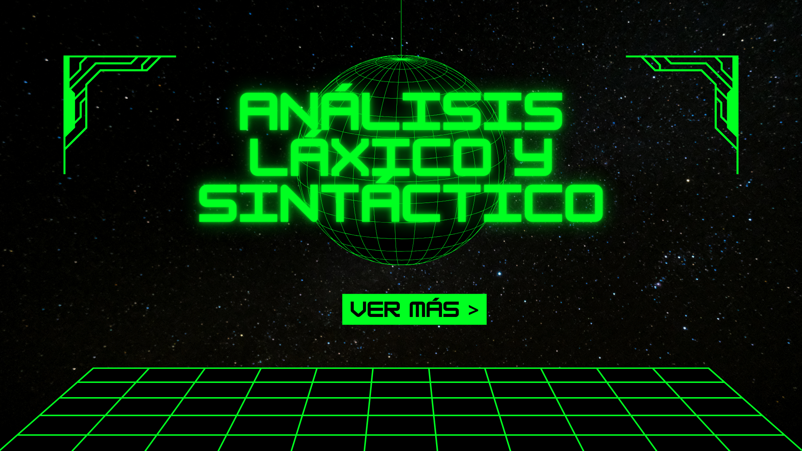

[](analisis/parser.py)

#Introducción al análisis láxico y sintáctico

Este proyecto implementa un analizador léxico y un analizador sintáctico basados en una gramática definida como complementos para un futuro compilador.

#Características principales

*Lexer personalizado con expresiones regulares
*Generación de tokens numéricos para facilitar la compatibilidad con la tabla LR
*Parser LR basado en:
    *Desplazamientos (shift)
    *Reducciones
    *Estados almacenados en una pila
*Soporte para más de 50 reglas gramaticales
*Representacion de no terminales mediante índices consecutivos 

#Arquitectura del proyecto

##lexer.py

*Contiene las reglas de identificación de tokens
*Implementa manualmente una logica para clasificar palabras clave e identificadores
*Devuelve una lista de tokens con formato **token -> numero_de_token, nombre**

##lista.py

*Define la tabla LR:
    *Matriz bidimensional con desplazamientos (>0)
    *Errores (0)
    *Reducciones(<0)

##parser.py

*Implementa la maquina LR
*Utiliza lis, la tabla LR generada.
*Contiene las reglas de producción (reducción) codificadas
*Permite verificar si la cadena es valida
*Imprime los no terminales generados por cada reducción

#¿Como implementarlo?

En la documentacion hay solamente tres archivos: `lexer.py`,`parser.py` y `lista.py`contenidos en la carpeta `analisis`. Para usar los analizadores en tu proyecto puedes simplemente copiar la carpeta `analisis` e importar `lexer.py`,`parser.py` y `lista.py` del paquete asociado `analisis`.

```python
from .analisis import lexer
from .analisis import lista
from .analisis import parser
```


